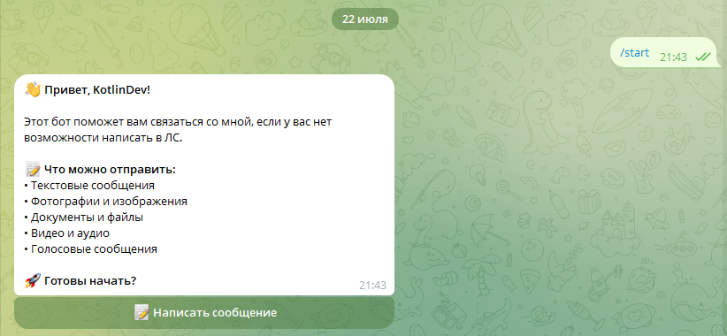
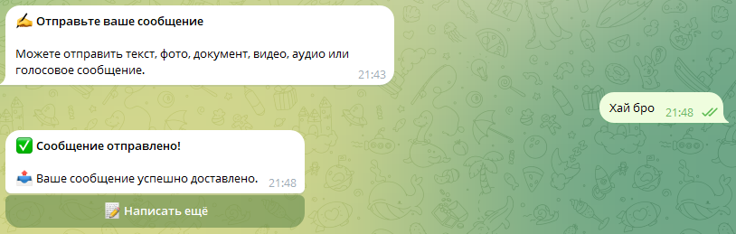
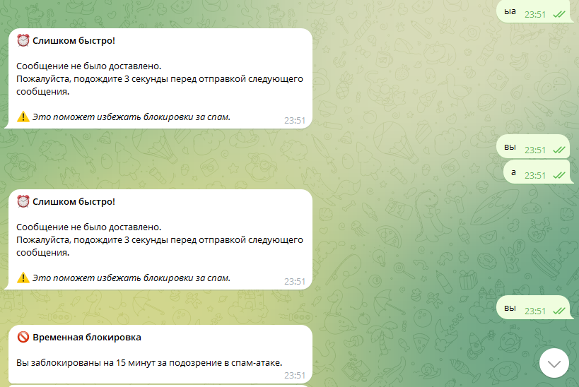
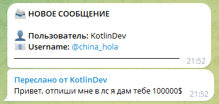

# 🤖 Telegram-Bot Forwarder

> 🔄 Удобный бот для пересылки сообщений с защитой от спама. Написан на Kotlin, использует SQLite для хранения данных. Пересылает сообщения администратору без лишней сложности.

⚡️ **Работает моментально** — обработка сообщений в реальном времени в JVM  
🛡️ **Умная защита от спама** с автоматическими блокировками  
📦 **Локальное хранение данных через SQLite** — не требует внешних серверов  
🚀 **Гибкая настройка** — все важные константы в одном классе

---

## 💬 Что умеет бот

- Пересылать администратору любые сообщения (текст, фото, видео, документы)
- Автоматически блокировать спамеров по гибким настройкам
- Работать с интерактивными кнопками для удобства пользователей
- Проверять наличие username у отправителей
- Вести историю сообщений в локальной базе SQLite

---

## 🚀 Настройка и запуск

1. Клонируем репозиторий:

```bash
git clone https://github.com/your-repo/telegram-forwarder-bot.git
```

2. Настраиваем бота в файле:

```kotlin
// src/main/kotlin/config/Config.kt
const val TOKEN = "ВАШ_ТОКЕН_БОТА"  // Получаем у @BotFather
const val ADMIN_ID = ВАШ_ID_ТЕЛЕГРАМ  // Узнать можно у @userinfobot
```

3. Собираем проект:

```bash
./gradlew jar
```

4. Запускаем:

```bash
java -jar build/libs/tg-rescue-1.0.jar
```

### ⚙️ Важные настройки

В том же файле Config.kt можно настроить:
```kotlin
const val MESSAGES_LIMIT_SECONDS = 3L  // Пауза между сообщениями
const val MAX_MESSAGE_IN_INTERVAL = 5L  // Лимит сообщений до блокировки
const val BLOCK_TIMEOUT_MINUTES = 15L   // Время блокировки нарушителей
```

---

## 🚀 Настроить и скомпилировать проект за тебя?

- **[Мой Telegram](https://t.me/china_hola)** 💼

---

## 📸 Как это выглядит

### 👋 Приветствие нового пользователя


### 📩 Успешная отправка сообщения


### ⛔ Блокировка спамера


### 💬 Вид от лица админа:


---

## 🧰 Технологии под капотом

- **Kotlin** — основной язык (привычный и мощный)
- **Kotlin Telegram Bot** — [библиотека для работы с Telegram](https://github.com/kotlin-telegram-bot/kotlin-telegram-bot)
- **SQLDelight** — [удобная работа с SQLite](https://cashapp.github.io/sqldelight/)
- **Coroutines** — [для плавной работы](https://kotlinlang.org/docs/coroutines-overview.html)

---

## ⚠️ Дисклеймер

> Я не несу ответственность за использование этого проекта, а так же не несу ответственность за сообщения, которые будут проходить через бот.

---

## 💖 Поддержать проект

Поставь звезду ⭐ репозиторию, если бот полезен! Это лучшая мотивация для развития.

---

### 💬 *"Просто отправь сообщение — остальное бот сделает за тебя"*